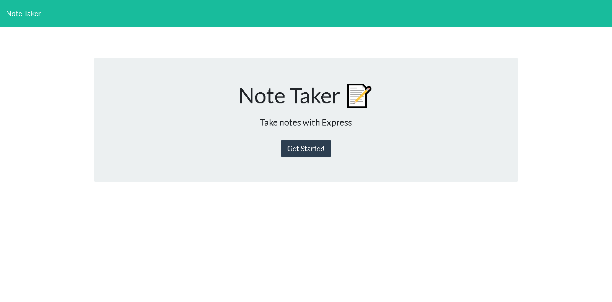

# Keep Track Note Taker

## Resources 
[GitHubLink](https://github.com/FocusKing/Keep-Track-Note-Taker)

## Badges

## Description
GIVEN a note-taking application
WHEN I open the Note Taker
THEN I am presented with a landing page with a link to a notes page
WHEN I click on the link to the notes page
THEN I am presented with a page with existing notes listed in the left-hand column, plus empty fields to enter a new note title and the note’s text in the right-hand column
WHEN I enter a new note title and the note’s text
THEN a Save icon appears in the navigation at the top of the page
WHEN I click on the Save icon
THEN the new note I have entered is saved and appears in the left-hand column with the other existing notes
WHEN I click on an existing note in the list in the left-hand column
THEN that note appears in the right-hand column
WHEN I click on the Write icon in the navigation at the top of the page
THEN I am presented with empty fields to enter a new note title and the note’s text in the right-hand column
## Table of Contents 

- [Installation](#installation)
- [Usage](#usage)
- [Visuals](#visuals)
- [Credits](#credits)
- [License](#license)
- [Test](#tests)

## Installation
Our challenge is to create an application called Note Taker that can be used to write and save notes. This application will use an Express.js back end and will save and retrieve note data from a JSON file.

## Usage
AS A manager
I WANT to generate a webpage that displays my team's basic info
SO THAT I have quick access to their emails and GitHub profiles  

## Visuals

## Credits
 I was fortunate enough to get additional assistance from class mates either during office hours or during private study group sessions after class. I truly appreciate any help that I have received throughout this project.

## License
MIT License

Copyright (c) [2022] [Marquise Allen]

## Tests
Great way to test the program is by using node index.js, review the terminal for any errors. You can also console log data to see how the program is running and what information is being pulled through. 